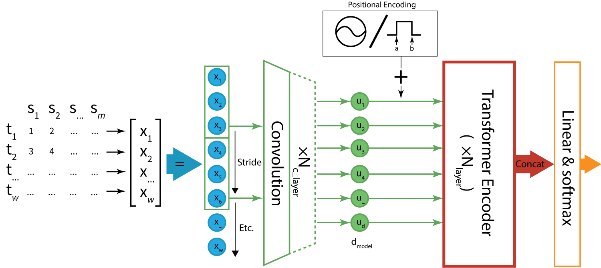
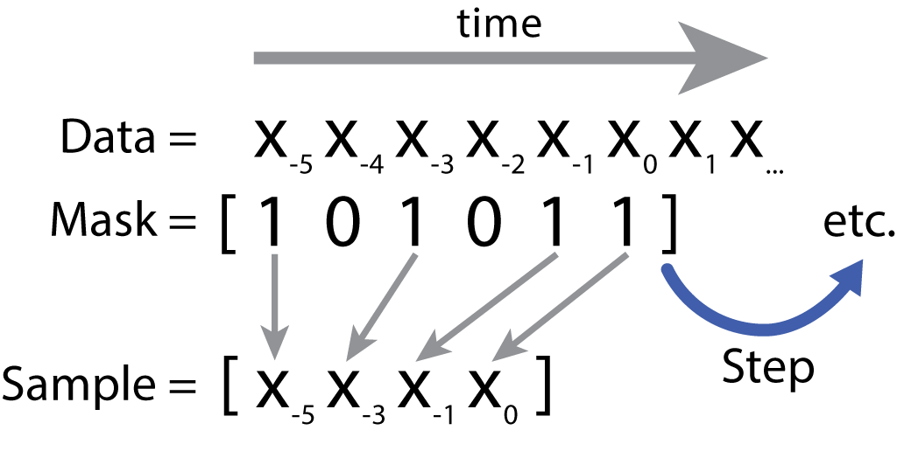

# MVTS-Learner

MVTS-learner is a GUI-based time-series machine learning framework for multivariate time-series classification tasks built using [Configurun](https://github.com/Woutah/configurun).
The framework has been built on top of the [mvts_transformer](https://github.com/gzerveas/mvts_transformer)-framework - as such, it supports its TST-architecture and any of the datasets described by these authors. We furthermore added additional classifiers and dataset support to the framework, as well as [Tensorboard](https://www.tensorflow.org/tensorboard/get_started) & [Wandb](https://wandb.ai/)-logging.

<!-- Instead of running the framework using a command-line, e.g.:
Instead of running the framework using a command-line, e.g.:
```bash
python main.py --experiment_name='UAE-UWaveGestureLibrary' --run_base_name='Wave-run' --excel='./records.xlsx' --task='classification' --use_gpu=0,1,2 --seed=1 --dim_model=256 --n_heads=16 --pos_encoding='learnable' ############# Etc ###############
```

<!-- The framework is made available to the user using an easy-to-use GUI, non-default options are displayed in bold so we can easily see what kind of configuration we're dealing with. On-hover, the help-messages of each option are shown. The following example shows the equivalent general & model-options: -->


The framwork-app can also be run as a client-server setup, allowing the user to queue and run experiments remotely using the GUI (see [Configurun](https://github.com/Woutah/configurun) for all features).

<p align="center">
	
</p>


Adding custom torch-based models is a relatively simple process, see the [following chapter](#custom-classifier) for more information.
For more examples of the features of the App, please also see the [Configurun-GitHub](https://github.com/Woutah/configurun)

## Table of Contents
- [MVTS-Learner](#mvts-learner)
	- [Table of Contents](#table-of-contents)
- [Supported Classifiers](#supported-classifiers)
	- [MCTST](#mctst)
- [Supported Data](#supported-data)
	- [Pandas-Dataset](#pandas-dataset)
- [Installation \& Running](#installation--running)
- [Results on the TSClassificationArchive](#results-on-the-tsclassificationarchive)
	- [Licenses](#licenses)
		- [MIT-License](#mit-license)


# Supported Classifiers
The framework supports the following multivariate time-series classification methods:
- [x] [TimeSeriesTransformer-classifier](https://github.com/gzerveas/mvts_transformer)
- [x] [(Multi)ConvolutionTimeSeriesTransformer-Classifier](#MCTST) (see below)
- [x] [Rocket](https://github.com/ChangWeiTan/TS-Extrinsic-Regression/blob/aed493c4b089459f899da5f988569c11931d8fa7/models/rocket.py#L117)
- [x] [XGBoost](https://xgboost.readthedocs.io/en/latest/)
- [x] [Sklearn-classifiers](https://scikit-learn.org/stable/)
  - [x] GaussianProcessClassifier
  - [x] DecisionTreeClassifier
  - [x] RandomForestClassifier
  - [x] AdaBoostClassifier
  - [x] NaiveBayes
  - [x] MPLClassifier
  - [x] GradientBoostingClassifier
  - [x] HistGradientBoostingClassifier
  - [x] RidgeCV-Classifier

Rocket is implemented as a feature-extractor/data preprocessor and can be combined with any of the other Sklearn-classifiers. 


## MCTST
The MCTST-model is a custom classifier based on the [TST-model](https://github.com/gzerveas/mvts_transformer). The use of convolutional layer has also been proposed for future work by these authors, they reported to have observed improved performance for certain datasets consisting of longer and lower-dimensional time-series in their initial tests. We expand upon this idea by experimenting with various amounts of stacked convolutional layers. All options are made accessible via the GUI as well. 
<p align="center">
	
</p>


# Supported Data
Various types of data should be supported, from the [base](https://github.com/gzerveas/mvts_transformer) framework, this framwork should supports the following:
- [x] HDD-Data
- [x] Weld-Data
- [x] [TSRegressionArchive](https://zenodo.org/record/3902651#.YB5P0OpOm3s)
- [x] [TSClassificationArchive](http://www.timeseriesclassification.com/Downloads/Archives/Multivariate2018_ts.zip) <--- Used Archive
- [x] SemicondTraceData

The TSClassificationArchive was used extensively, the rest *should* work, but has not been tested. We have furthermore implemented the Pandas-based dataset:
- [x] Pandas


## Pandas-Dataset
The pandas-dataset type allows us to sample (long) continuous multivariate time-series datasets into samples of a fixed length. 
Using the framework, we can specify a window size, a step size and a number of samples to be taken from each time-series, as well as the features to be used, as depicted in the following image:

<p align="center">
	
</p>

Some more documentation can be found in the file itsef under [`./mvts_learner/data/data_loader/pandas_data.py`](./mvts_learner/data/data_loader/pandas_data.py); as well as in the GUI itself - all options show a help-message on hover.

An example of a compatible Dataframe would be:

<center>

| DateTime 				| sensor1 	| sensor2 	| label | group	|
| --- 					| --- 		| --- 		| --- 	| --- 	|
| 2020-01-01 00:00:00 	| 0.1 		| 0.2 		| 0 	| location1
| 2020-01-01 00:00:01 	| 0.2 		| 0.3 		| 0 	| location1
| 2020-01-01 00:00:02 	| 0.3 		| 0.4 		| 0 	| location1
| 2020-01-01 00:00:03 	| 0.4 		| 0.5 		| 0 	| location1
| 2020-01-02 00:00:00 	| 0.9 		| 0.1 		| 1 	| location2
| etc. 					| etc. 		| etc. 		| etc. 	| etc.

</center>
The group-column is optional, but can be used to split the dataset using these groups such that we don't train on data from "in-between" the test or validation set. Alternatively, a separate dataset can be specified for testing and validation. Each row corresponds to a single time-step, and each column to a single feature. 

For preprocessing, analysis & labeling the data, we have also implemented [MVTS-Analyzer](https://github.com/Woutah/MVTS-Analyzer) - a GUI-based tool for multivariate time-series. This tool allows us to label data in a GUI, and export it so that it can directly be used as input for MVTS-learner:

<p align="center">
	
</p>

MVTS-Analyzer is installable as a python package (`pip install mvts-analyzer`), and can be run using `mvtsa` in the terminal - please see its [Github-page](https://github.com/Woutah/MVTS-Analyzer) for more information.

# Installation & Running

First clone the repository:
```bash
git clone https://github.com/Woutah/MVTS-Learner
```

Then go to the download folder and install the requirements:
```bash
pip install -r ./requirements.txt
python ./mvts_learner/main.py <options> {local,server,client} #Launch the app
```

Or install the app as a package:
```bash
pip install . 
mvts-learner <options> {local,server,client} #Launch the app in passed mode
mvtsl <options> {local,server,client} #Short-hand
```

- [ ] TODO: make installable via PyPi 

# Results on the TSClassificationArchive

All tests were run using the Archive-specified train/test splits. All hyperparameters (including epochs) were optimized using 5 to 10 fold cross-validation on the training set, and the best hyperparameters were used to train the model on the entire training set for the amount of epochs determined during hyperparameter tuning. The test set was then used to evaluate the model. Testing was done 5 times, which resulted in the following mean-accuracy scores (**bold**=best, <u>underline</u>=second best, ***italic***=third best)

**Dataset** 			| **MCTST** 		| **CTST** 		| **TST** 			| **Rocket**	| **GBoost** 	| **XGBoost** 		| **XGBR**
---						| ---				| ---			| ---				| ---			| ---			| --- 				| --- 		
**Eth. Concentration** 	| 0.398 			| 0.324 		| 0.280 			| 0.381 		| <u> 0.439</u>	| **0.449** 		| *0.418*
**FaceDetection** 		| **0.679** 		| *0.668*		| <u>0.671</u> 		| 0.618			| 0.661 		| 0.589 			| 0.573
**Handwriting** 		| *0.327*			| <u>0.371</u> 	| 0.308 			| **0.555** 	| 0.105 		| 0.167 			| 0.321
**Heartbeat** 			| 0.658 			| 0.678 		| 0.699 			| *0.710*		| **0.754**		| 0.693 			| <u>0.717</u>
**JapaneseVowels** 		| 0.970 			| *0.975*		| <u>0.976</u> 		| **0.985**		| 0.905 		| 0.908 			| 0.953
**PEMS-SF** 			| 0.753 			| 0.831 		| 0.822 			| 0.761			| **0.996**		| <u>0.983</u>		| *0.949*
**SelfRegulationSCP1** 	| *0.885*			| **0.889**		| <u>0.886</u>		| 0.883 		| 0.819 		| 0.826 			| 0.811
**SelfRegulationSCP2** 	| 0.479 			| *0.524* 		| 0.520 			| **0.602**		| 0.478 		| 0.467 			| <u>0.531</u>
**SpokenArabicDigits** 	| <u>0.992</u>		| 0.988 		| *0.990*			| **0.997**		| 0.970 		| 0.970 			| 0.986
**Wave G. Library** 	| <u>0.880</u>		| 0.862 		| 0.866 			| **0.918**		| 0.659 		| 0.759 			| *0.875*
---						| ---				| ---			| ---				| ---			| ---			| --- 				| --- 		
**Mean-Accuracy** 		| 0.702 			| *0.711*		| 0.702 			| **0.741**		| 0.679 		| 0.681 			| <u>0.713</u>

## Licenses
Most importantly, the code under `/rocket/` is licensed under a separate GPL-license, please see the license file in that folder and the Readme.

All code from the [MVTS_transformer](https://github.com/gzerveas/mvts_transformer/blob/master/LICENSE)-repository is licensed under the MIT-license (see below)

### MIT-License
MIT License

Copyright (c) 2021 George Zerveas

Permission is hereby granted, free of charge, to any person obtaining a copy of this software and associated documentation files (the "Software"), to deal in the Software without restriction, including without limitation the rights to use, copy, modify, merge, publish, distribute, sublicense, and/or sell copies of the Software, and to permit persons to whom the Software is furnished to do so, subject to the following conditions:

The above copyright notice and this permission notice shall be included in all copies or substantial portions of the Software.

THE SOFTWARE IS PROVIDED "AS IS", WITHOUT WARRANTY OF ANY KIND, EXPRESS OR IMPLIED, INCLUDING BUT NOT LIMITED TO THE WARRANTIES OF MERCHANTABILITY, FITNESS FOR A PARTICULAR PURPOSE AND NONINFRINGEMENT. IN NO EVENT SHALL THE AUTHORS OR COPYRIGHT HOLDERS BE LIABLE FOR ANY CLAIM, DAMAGES OR OTHER LIABILITY, WHETHER IN AN ACTION OF CONTRACT, TORT OR OTHERWISE, ARISING FROM, OUT OF OR IN CONNECTION WITH THE SOFTWARE OR THE USE OR OTHER DEALINGS IN THE SOFTWARE.
